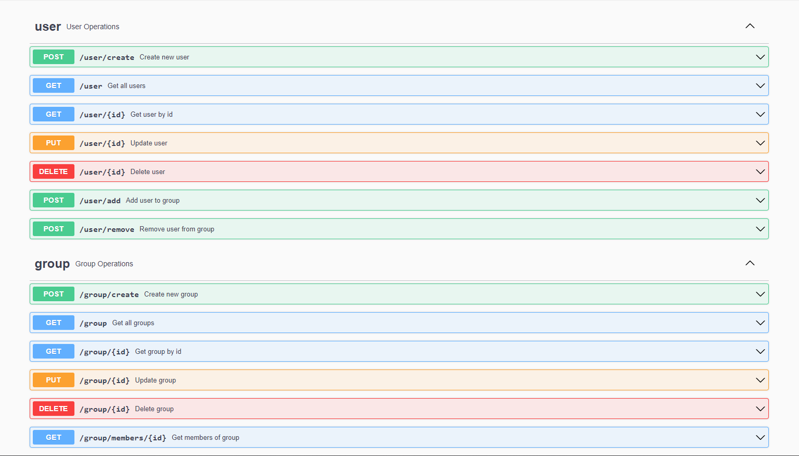

# user-groups-api

Simple API to handle users and groups using Docker / Python / Flask / nginx / uWSGI / SQLite

## Local setup

1. Clone the repo into your local
   ```
   git clone https://github.com/bcaglaraydin/user-groups-api/
   ```
2. Make sure you have docker-compose and docker installed on your machine

3. Run the following command
   ```
   docker-compose up
   ```
4. Visit localhost/docs from your browser, you'll see the docs

5. In order to run tests
   ```
   cd flask/tests && python -m unittest group_test user_test
   ```
## Docs
   
   
## Contact

Berdan Çağlar Aydın - https://www.linkedin.com/in/bcaglaraydin/ - berdancaglaraydin@gmail.com

Project Link: https://github.com/bcaglaraydin/user-groups-api
